# Vision Agents Architecture Documentation

This document provides a comprehensive architectural overview of the Vision Agents project using Mermaid diagrams.

---

## Table of Contents

1. [System Architecture Overview](#system-architecture-overview)
2. [Package Structure](#package-structure)
3. [Component Diagram](#component-diagram)
4. [Class Diagrams](#class-diagrams)
5. [Sequence Diagrams](#sequence-diagrams)
6. [Data Flow Diagrams](#data-flow-diagrams)
7. [State Diagrams](#state-diagrams)
8. [Event Flow Diagrams](#event-flow-diagrams)
9. [Plugin Architecture](#plugin-architecture)
10. [Deployment Architecture](#deployment-architecture)
11. [Session Management](#session-management)
12. [HTTP API Architecture](#http-api-architecture)

---

## System Architecture Overview

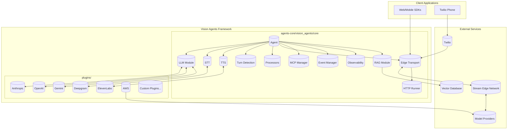
```mermaid
flowchart TB
    subgraph Client["Client Applications"]
        UI[Web/Mobile SDKs]
        Phone[Twilio Phone]
    end
    
    subgraph VisionAgents["Vision Agents Framework"]
        subgraph Core["agents-core/vision_agents/core"]
            Agent[("Agent")]
            LLM[("LLM Module")]
            STT[("STT")]
            TTS[("TTS")]
            TurnDetection[("Turn Detection")]
            Processors[("Processors")]
            Edge[("Edge Transport")]
            MCP[("MCP Manager")]
            Events[("Event Manager")]
            Observability[("Observability")]
            Runner[("HTTP Runner")]
            RAG[("RAG Module")]
        end
        
        subgraph Plugins["plugins/"]
            Anthropic[("Anthropic")]
            OpenAI[("OpenAI")]
            Gemini[("Gemini")]
            Deepgram[("Deepgram")]
            ElevenLabs[("ElevenLabs")]
            AWS[("AWS")]
            Custom[("Custom Plugins...")]
        end
    end
    
    subgraph External["External Services"]
        StreamEdge[("Stream Edge Network")]
        ModelProviders[("Model Providers")]
        VectorDB[("Vector Database")]
        Twilio[("Twilio")]
    end
    
    UI --> Edge
    Phone --> Twilio
    Twilio --> Edge
    
    Edge <--> StreamEdge
    Agent --> LLM
    Agent --> STT
    Agent --> TTS
    Agent --> TurnDetection
    Agent --> Processors
    Agent --> Edge
    Agent --> MCP
    Agent --> Events
    Agent --> Observability
    Agent --> RAG
    
    LLM <--> Anthropic
    LLM <--> OpenAI
    LLM <--> Gemini
    STT <--> Deepgram
    TTS <--> ElevenLabs
    AWS --> ModelProviders
    RAG --> VectorDB
    
    StreamEdge <--> ModelProviders
    Edge --> Runner
```

---

## Package Structure

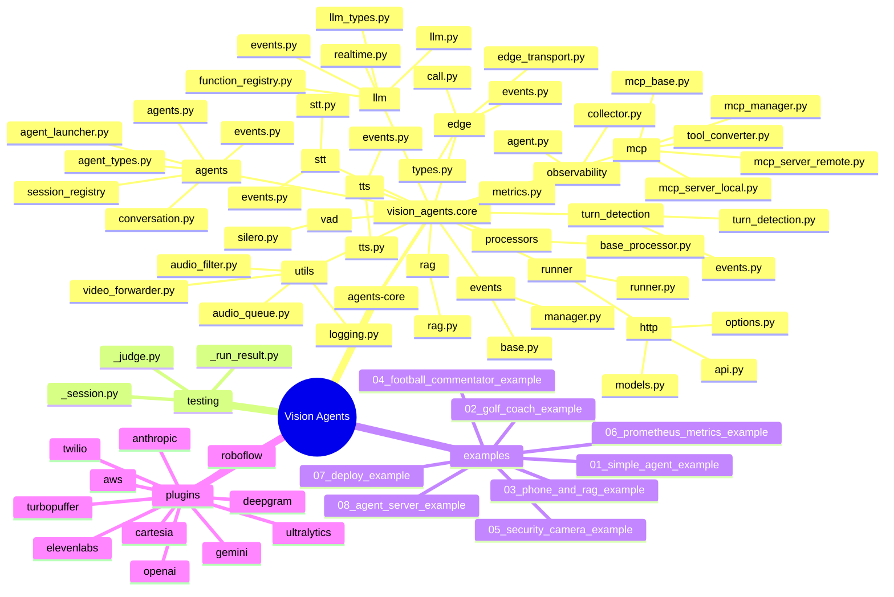
```mermaid
mindmap
  root((Vision Agents))
    agents-core
      vision_agents.core
        agents
          agents.py
          agent_launcher.py
          conversation.py
          events.py
          agent_types.py
          session_registry
        llm
          llm.py
          realtime.py
          events.py
          function_registry.py
          llm_types.py
        edge
          edge_transport.py
          events.py
          types.py
          call.py
        events
          manager.py
          base.py
        stt
          stt.py
          events.py
        tts
          tts.py
          events.py
        turn_detection
          turn_detection.py
          events.py
        processors
          base_processor.py
        mcp
          mcp_manager.py
          mcp_base.py
          mcp_server_local.py
          mcp_server_remote.py
          tool_converter.py
        observability
          collector.py
          metrics.py
          agent.py
        runner
          runner.py
          http
            api.py
            models.py
            options.py
        rag
          rag.py
        utils
          audio_queue.py
          video_forwarder.py
          audio_filter.py
          logging.py
        vad
          silero.py
    testing
      _session.py
      _run_result.py
      _judge.py
    examples
      01_simple_agent_example
      02_golf_coach_example
      03_phone_and_rag_example
      04_football_commentator_example
      05_security_camera_example
      06_prometheus_metrics_example
      07_deploy_example
      08_agent_server_example
    plugins
      anthropic
      aws
      openai
      gemini
      deepgram
      elevenlabs
      cartesia
      twilio
      turbopuffer
      roboflow
      ultralytics
```

---

## Component Diagram

```mermaid
graph TD
    subgraph Agent["Agent Component"]
        AgentCore[("Agent")]
        EventManager[("Event Manager")]
        MCPManager[("MCP Manager")]
        Metrics[("Metrics Collector")]
    end
    
    subgraph Media["Media Processing"]
        AudioQueue[("Audio Queue")]
        VideoForwarder[("Video Forwarder")]
        AudioFilter[("Audio Filter")]
    end
    
    subgraph AI["AI Components"]
        LLM[("LLM")]
        AudioLLM[("Audio LLM")]
        VideoLLM[("Video LLM")]
        Realtime[("Realtime LLM")]
        STT[("STT")]
        TTS[("TTS")]
        TurnDetector[("Turn Detector")]
    end
    
    subgraph Processors["Processors"]
        VideoProcessor[("Video Processor")]
        AudioProcessor[("Audio Processor")]
        VideoPublisher[("Video Publisher")]
        AudioPublisher[("Audio Publisher")]
    end
    
    subgraph Transport["Transport Layer"]
        EdgeTransport[("Edge Transport")]
        Call[("Call")]
        Connection[("Connection")]
    end
    
    subgraph Storage["Storage"]
        Conversation[("Conversation")]
        SessionRegistry[("Session Registry")]
    end
    
    AgentCore --> EventManager
    AgentCore --> MCPManager
    AgentCore --> Metrics
    AgentCore --> AudioQueue
    AgentCore --> VideoForwarder
    AgentCore --> AudioFilter
    AgentCore --> LLM
    AgentCore --> AudioLLM
    AgentCore --> VideoLLM
    AgentCore --> Realtime
    AgentCore --> STT
    AgentCore --> TTS
    AgentCore --> TurnDetector
    AgentCore --> VideoProcessor
    AgentCore --> AudioProcessor
    AgentCore --> VideoPublisher
    AgentCore --> AudioPublisher
    AgentCore --> EdgeTransport
    AgentCore --> Conversation
    
    EdgeTransport --> Call
    EdgeTransport --> Connection
    
    SessionRegistry --> Conversation
    
    LLM --> AudioLLM
    LLM --> VideoLLM
    LLM --> Realtime
```

---

## Class Diagrams

### Agent Core Class

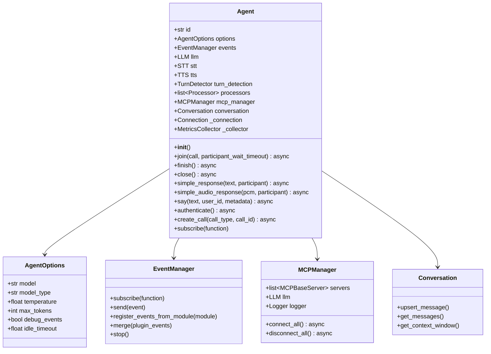
```mermaid
classDiagram
    class Agent {
        +str id
        +AgentOptions options
        +EventManager events
        +LLM llm
        +STT stt
        +TTS tts
        +TurnDetector turn_detection
        +list~Processor~ processors
        +MCPManager mcp_manager
        +Conversation conversation
        +Connection _connection
        +MetricsCollector _collector
        
        +__init__()
        +join(call, participant_wait_timeout) async
        +finish() async
        +close() async
        +simple_response(text, participant) async
        +simple_audio_response(pcm, participant) async
        +say(text, user_id, metadata) async
        +authenticate() async
        +create_call(call_type, call_id) async
        +subscribe(function)
    }
    
    class AgentOptions {
        +str model
        +str model_type
        +float temperature
        +int max_tokens
        +bool debug_events
        +float idle_timeout
    }
    
    class EventManager {
        +subscribe(function)
        +send(event)
        +register_events_from_module(module)
        +merge(plugin_events)
        +stop()
    }
    
    class MCPManager {
        +list~MCPBaseServer~ servers
        +LLM llm
        +Logger logger
        
        +connect_all() async
        +disconnect_all() async
    }
    
    class Conversation {
        +upsert_message()
        +get_messages()
        +get_context_window()
    }
    
    Agent --> AgentOptions
    Agent --> EventManager
    Agent --> MCPManager
    Agent --> Conversation
```

### LLM Class Hierarchy

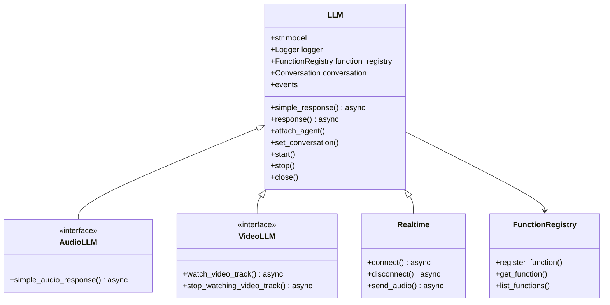
```mermaid
classDiagram
    class LLM {
        +str model
        +Logger logger
        +FunctionRegistry function_registry
        +Conversation conversation
        +events
        
        +simple_response() async
        +response() async
        +attach_agent() 
        +set_conversation()
        +start()
        +stop()
        +close()
    }
    
    class AudioLLM {
        <<interface>>
        +simple_audio_response() async
    }
    
    class VideoLLM {
        <<interface>>
        +watch_video_track() async
        +stop_watching_video_track() async
    }
    
    class Realtime {
        +connect() async
        +disconnect() async
        +send_audio() async
    }
    
    class FunctionRegistry {
        +register_function()
        +get_function()
        +list_functions()
    }
    
    LLM <|-- AudioLLM
    LLM <|-- VideoLLM
    LLM <|-- Realtime
    LLM --> FunctionRegistry
```

### Processor Base Classes

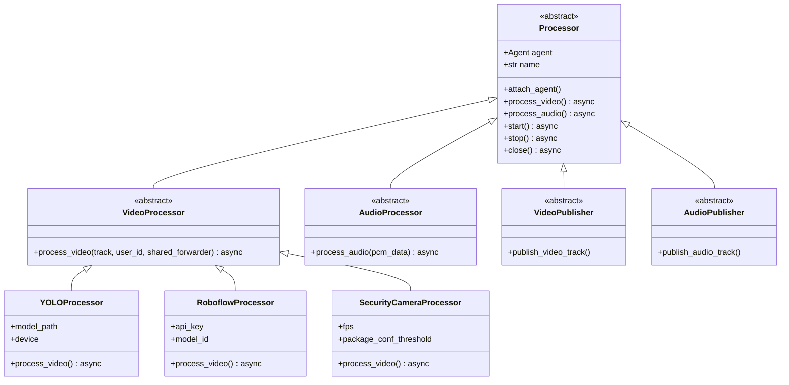
```mermaid
classDiagram
    class Processor {
        <<abstract>>
        +Agent agent
        +str name
        
        +attach_agent()
        +process_video() async
        +process_audio() async
        +start() async
        +stop() async
        +close() async
    }
    
    class VideoProcessor {
        <<abstract>>
        +process_video(track, user_id, shared_forwarder) async
    }
    
    class AudioProcessor {
        <<abstract>>
        +process_audio(pcm_data) async
    }
    
    class VideoPublisher {
        <<abstract>>
        +publish_video_track()
    }
    
    class AudioPublisher {
        <<abstract>>
        +publish_audio_track()
    }
    
    class YOLOProcessor {
        +model_path
        +device
        +process_video() async
    }
    
    class RoboflowProcessor {
        +api_key
        +model_id
        +process_video() async
    }
    
    class SecurityCameraProcessor {
        +fps
        +package_conf_threshold
        +process_video() async
    }
    
    Processor <|-- VideoProcessor
    Processor <|-- AudioProcessor
    Processor <|-- VideoPublisher
    Processor <|-- AudioPublisher
    VideoProcessor <|-- YOLOProcessor
    VideoProcessor <|-- RoboflowProcessor
    VideoProcessor <|-- SecurityCameraProcessor
```

---

## Sequence Diagrams

### Agent Lifecycle

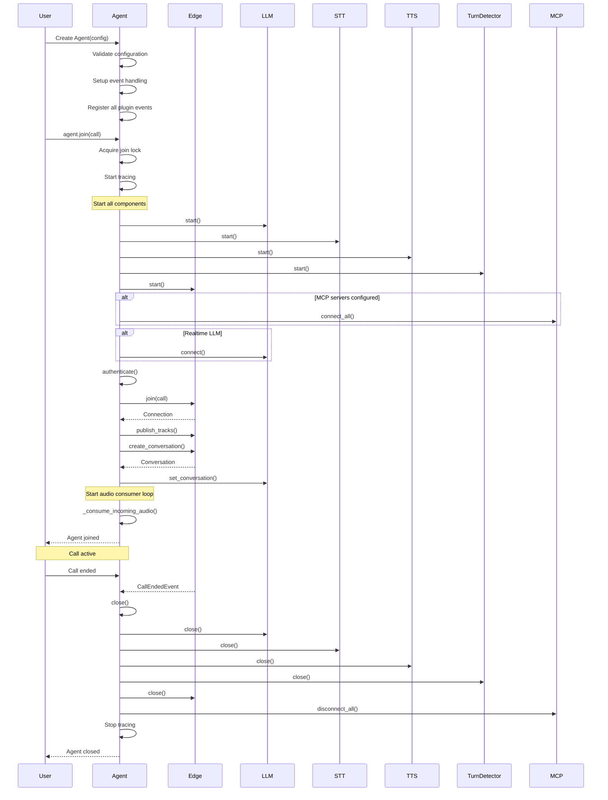
```mermaid
sequenceDiagram
    participant User
    participant Agent
    participant Edge
    participant LLM
    participant STT
    participant TTS
    participant TurnDetector
    participant MCP
    
    User->>Agent: Create Agent(config)
    Agent->>Agent: Validate configuration
    Agent->>Agent: Setup event handling
    Agent->>Agent: Register all plugin events
    
    User->>Agent: agent.join(call)
    Agent->>Agent: Acquire join lock
    Agent->>Agent: Start tracing
    
    Note over Agent: Start all components
    Agent->>LLM: start()
    Agent->>STT: start()
    Agent->>TTS: start()
    Agent->>TurnDetector: start()
    Agent->>Edge: start()
    
    alt MCP servers configured
        Agent->>MCP: connect_all()
    end
    
    alt Realtime LLM
        Agent->>LLM: connect()
    end
    
    Agent->>Agent: authenticate()
    Agent->>Edge: join(call)
    Edge-->>Agent: Connection
    
    Agent->>Edge: publish_tracks()
    Agent->>Edge: create_conversation()
    Edge-->>Agent: Conversation
    
    Agent->>LLM: set_conversation()
    
    Note over Agent: Start audio consumer loop
    Agent->>Agent: _consume_incoming_audio()
    
    Agent-->>User: Agent joined
    
    Note over User,Agent: Call active
    
    User->>Agent: Call ended
    Edge-->>Agent: CallEndedEvent
    Agent->>Agent: close()
    
    Agent->>LLM: close()
    Agent->>STT: close()
    Agent->>TTS: close()
    Agent->>TurnDetector: close()
    Agent->>Edge: close()
    Agent->>MCP: disconnect_all()
    Agent->>Agent: Stop tracing
    Agent-->>User: Agent closed
```

### Audio Processing Pipeline

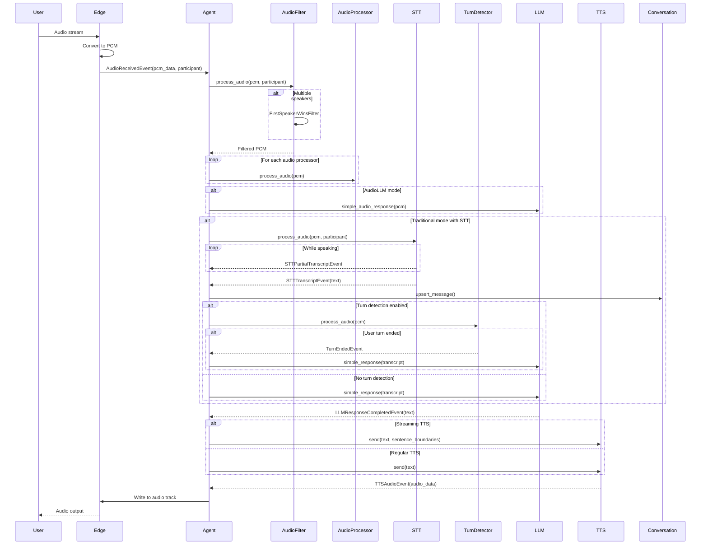
```mermaid
sequenceDiagram
    participant User
    participant Edge
    participant Agent
    participant AudioFilter
    participant AudioProcessor
    participant STT
    participant TurnDetector
    participant LLM
    participant TTS
    
    User->>Edge: Audio stream
    Edge->>Edge: Convert to PCM
    Edge->>Agent: AudioReceivedEvent(pcm_data, participant)
    
    Agent->>AudioFilter: process_audio(pcm, participant)
    
    alt Multiple speakers
        AudioFilter->>AudioFilter: FirstSpeakerWinsFilter
    end
    
    AudioFilter-->>Agent: Filtered PCM
    
    loop For each audio processor
        Agent->>AudioProcessor: process_audio(pcm)
    end
    
    alt AudioLLM mode
        Agent->>LLM: simple_audio_response(pcm)
    end
    
    alt Traditional mode with STT
        Agent->>STT: process_audio(pcm, participant)
        
        loop While speaking
            STT-->>Agent: STTPartialTranscriptEvent
        end
        
        STT-->>Agent: STTTranscriptEvent(text)
        
        Agent->>Conversation: upsert_message()
        
        alt Turn detection enabled
            Agent->>TurnDetector: process_audio(pcm)
            
            alt User turn ended
                TurnDetector-->>Agent: TurnEndedEvent
                
                Agent->>LLM: simple_response(transcript)
            end
        else No turn detection
            Agent->>LLM: simple_response(transcript)
        end
    end
    
    LLM-->>Agent: LLMResponseCompletedEvent(text)
    
    alt Streaming TTS
        Agent->>TTS: send(text, sentence_boundaries)
    else Regular TTS
        Agent->>TTS: send(text)
    end
    
    TTS-->>Agent: TTSAudioEvent(audio_data)
    Agent->>Edge: Write to audio track
    Edge-->>User: Audio output
```

### Video Processing Pipeline

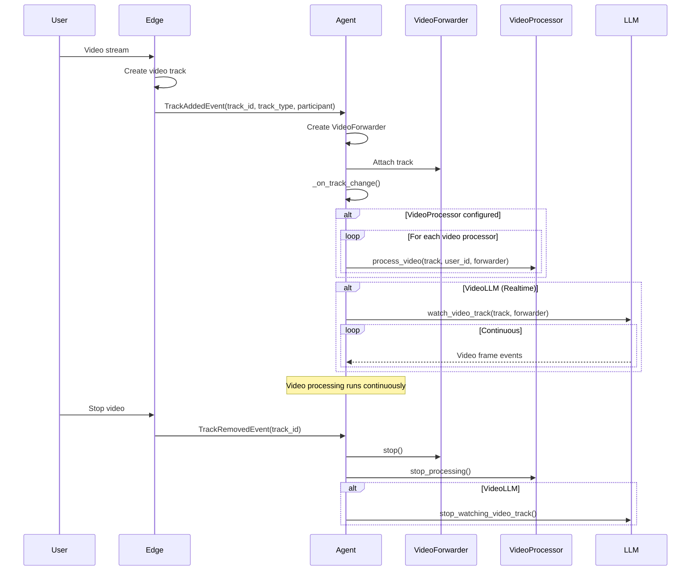
```mermaid
sequenceDiagram
    participant User
    participant Edge
    participant Agent
    participant VideoForwarder
    participant VideoProcessor
    participant LLM
    
    User->>Edge: Video stream
    Edge->>Edge: Create video track
    Edge->>Agent: TrackAddedEvent(track_id, track_type, participant)
    
    Agent->>Agent: Create VideoForwarder
    Agent->>VideoForwarder: Attach track
    
    Agent->>Agent: _on_track_change()
    
    alt VideoProcessor configured
        loop For each video processor
            Agent->>VideoProcessor: process_video(track, user_id, forwarder)
        end
    end
    
    alt VideoLLM (Realtime)
        Agent->>LLM: watch_video_track(track, forwarder)
        
        loop Continuous
            LLM-->>Agent: Video frame events
        end
    end
    
    Note over Agent: Video processing runs continuously
    
    User->>Edge: Stop video
    Edge->>Agent: TrackRemovedEvent(track_id)
    
    Agent->>VideoForwarder: stop()
    Agent->>VideoProcessor: stop_processing()
    
    alt VideoLLM
        Agent->>LLM: stop_watching_video_track()
    end
```

### Turn Detection Flow

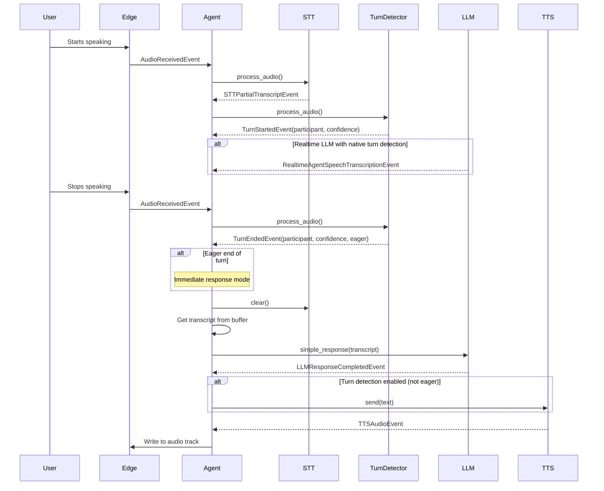
```mermaid
sequenceDiagram
    participant User
    participant Edge
    participant Agent
    participant STT
    participant TurnDetector
    participant LLM
    participant TTS
    
    User->>Edge: Starts speaking
    Edge->>Agent: AudioReceivedEvent
    
    Agent->>STT: process_audio()
    STT-->>Agent: STTPartialTranscriptEvent
    Agent->>TurnDetector: process_audio()
    
    TurnDetector-->>Agent: TurnStartedEvent(participant, confidence)
    
    alt Realtime LLM with native turn detection
        LLM-->>Agent: RealtimeAgentSpeechTranscriptionEvent
    end
    
    User->>Edge: Stops speaking
    Edge->>Agent: AudioReceivedEvent
    
    Agent->>TurnDetector: process_audio()
    TurnDetector-->>Agent: TurnEndedEvent(participant, confidence, eager)
    
    alt Eager end of turn
        Note over Agent: Immediate response mode
    end
    
    Agent->>STT: clear()
    Agent->>Agent: Get transcript from buffer
    
    Agent->>LLM: simple_response(transcript)
    
    LLM-->>Agent: LLMResponseCompletedEvent
    
    alt Turn detection enabled (not eager)
        Agent->>TTS: send(text)
    end
    
    TTS-->>Agent: TTSAudioEvent
    Agent->>Edge: Write to audio track
```

### MCP Tool Calling Flow

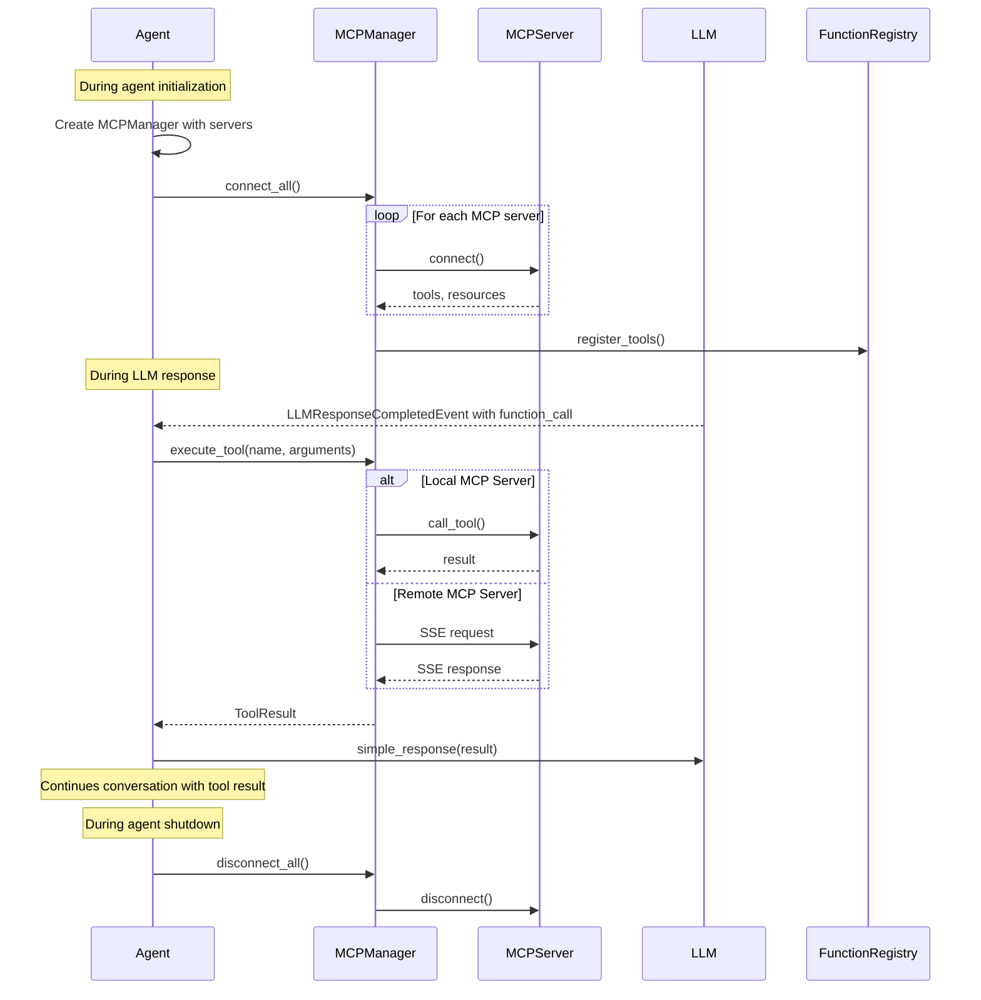
```mermaid
sequenceDiagram
    participant Agent
    participant MCPManager
    participant MCPServer
    participant LLM
    participant FunctionRegistry
    
    Note over Agent: During agent initialization
    Agent->>Agent: Create MCPManager with servers
    Agent->>MCPManager: connect_all()
    
    loop For each MCP server
        MCPManager->>MCPServer: connect()
        MCPServer-->>MCPManager: tools, resources
    end
    
    MCPManager->>FunctionRegistry: register_tools()
    
    Note over Agent: During LLM response
    
    LLM-->>Agent: LLMResponseCompletedEvent with function_call
    
    Agent->>MCPManager: execute_tool(name, arguments)
    
    alt Local MCP Server
        MCPManager->>MCPServer: call_tool()
        MCPServer-->>MCPManager: result
    else Remote MCP Server
        MCPManager->>MCPServer: SSE request
        MCPServer-->>MCPManager: SSE response
    end
    
    MCPManager-->>Agent: ToolResult
    
    Agent->>LLM: simple_response(result)
    
    Note over Agent: Continues conversation with tool result
    
    Note over Agent: During agent shutdown
    Agent->>MCPManager: disconnect_all()
    MCPManager->>MCPServer: disconnect()
```

---

## Data Flow Diagrams

### Complete Audio/Video Data Flow

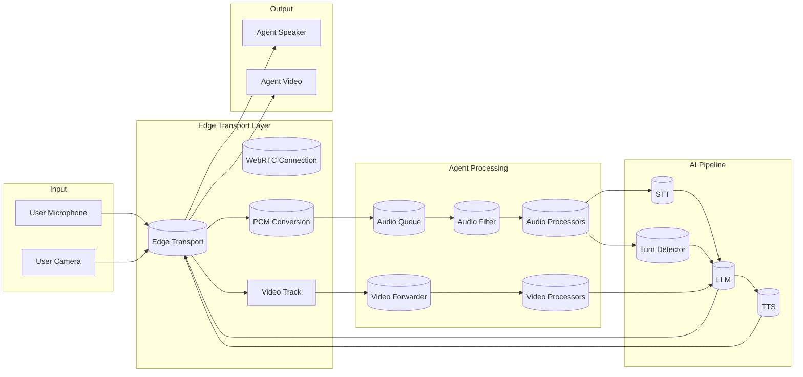
```mermaid
flowchart LR
    subgraph Input["Input"]
        UserMic["User Microphone"]
        UserCam["User Camera"]
    end
    
    subgraph EdgeNetwork["Edge Transport Layer"]
        Edge[("Edge Transport")]
        RTC[("WebRTC Connection")]
        PCM[("PCM Conversion")]
        VideoTrack["Video Track"]
    end
    
    subgraph Agent["Agent Processing"]
        AQ[("Audio Queue")]
        VF[("Video Forwarder")]
        AF[("Audio Filter")]
        AP[("Audio Processors")]
        VP[("Video Processors")]
    end
    
    subgraph AI["AI Pipeline"]
        STT[("STT")]
        TD[("Turn Detector")]
        LLM[("LLM")]
        TTS[("TTS")]
    end
    
    subgraph Output["Output"]
        AgentMic["Agent Speaker"]
        AgentCam["Agent Video"]
    end
    
    UserMic --> Edge
    Edge --> PCM
    PCM --> AQ
    
    UserCam --> Edge
    Edge --> VideoTrack
    VideoTrack --> VF
    
    AQ --> AF
    AF --> AP
    
    AP --> STT
    AP --> TD
    
    STT --> LLM
    TD --> LLM
    
    LLM --> TTS
    TTS --> Edge
    Edge --> AgentMic
    
    VF --> VP
    VP --> LLM
    
    LLM --> Edge
    Edge --> AgentCam
```

### Event Data Flow

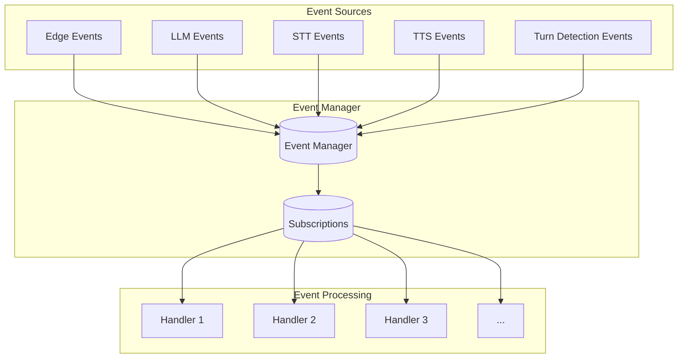
```mermaid
flowchart TB
    subgraph Sources["Event Sources"]
        EdgeEvents["Edge Events"]
        LLMEvents["LLM Events"]
        STTEvents["STT Events"]
        TTSEvents["TTS Events"]
        TDEvents["Turn Detection Events"]
    end
    
    subgraph EventManager["Event Manager"]
        EM[("Event Manager")]
        Sub[("Subscriptions")]
    end
    
    subgraph Processing["Event Processing"]
        Handler1["Handler 1"]
        Handler2["Handler 2"]
        Handler3["Handler 3"]
        HandlerN["..."]
    end
    
    EdgeEvents --> EM
    LLMEvents --> EM
    STTEvents --> EM
    TTSEvents --> EM
    TDEvents --> EM
    
    EM --> Sub
    Sub --> Handler1
    Sub --> Handler2
    Sub --> Handler3
    Sub --> HandlerN
```

---

## State Diagrams

### Agent State Machine

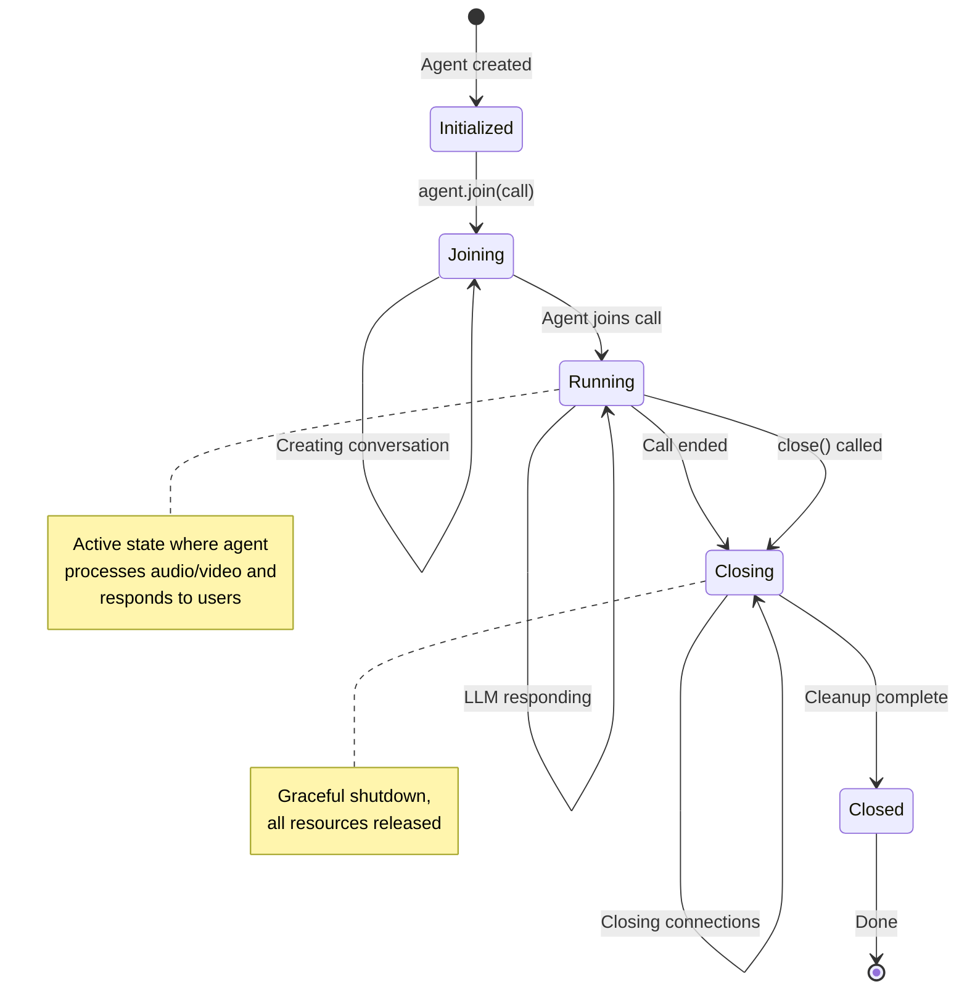
```mermaid
stateDiagram-v2
    [*] --> Initialized: Agent created
    
    Initialized --> Joining: agent.join(call)
    Joining --> Joining: Authenticating
    Joining --> Joining: Publishing tracks
    Joining --> Joining: Creating conversation
    
    Joining --> Running: Agent joins call
    Running --> Running: Processing audio
    Running --> Running: Processing video
    Running --> Running: LLM responding
    
    Running --> Closing: Call ended
    Running --> Closing: close() called
    
    Closing --> Closing: Stopping components
    Closing --> Closing: Disconnecting MCP
    Closing --> Closing: Closing connections
    
    Closing --> Closed: Cleanup complete
    Closed --> [*]: Done
    
    note right of Running
        Active state where agent
        processes audio/video and
        responds to users
    end note
    
    note right of Closing
        Graceful shutdown,
        all resources released
    end note
```

### Connection State

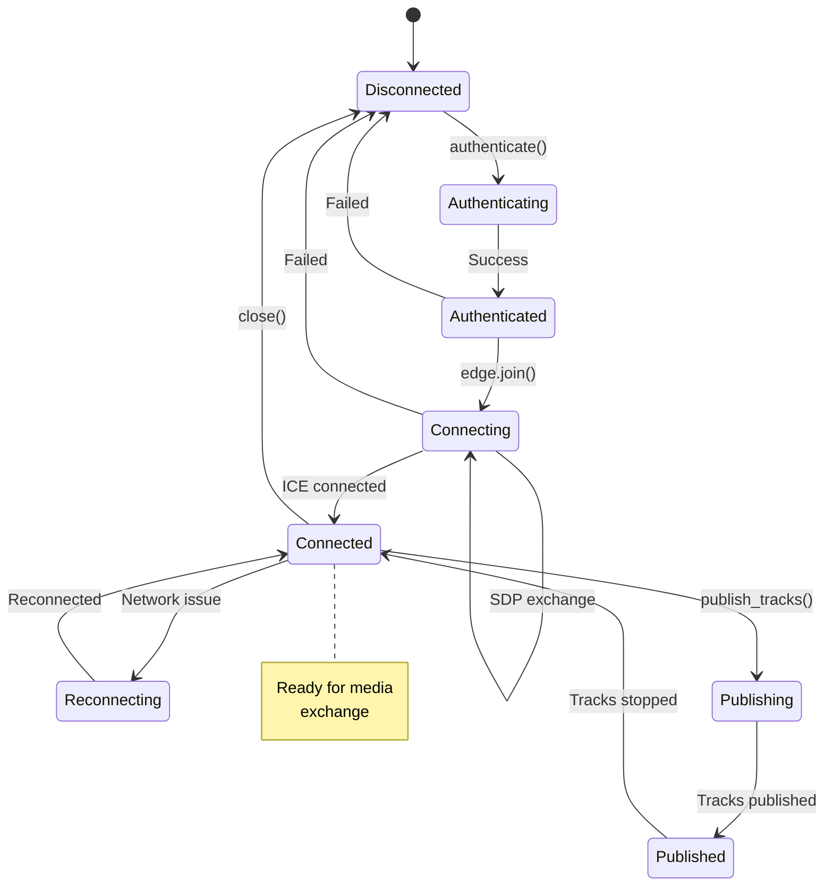
```mermaid
stateDiagram-v2
    [*] --> Disconnected
    
    Disconnected --> Authenticating: authenticate()
    Authenticating --> Authenticated: Success
    
    Authenticated --> Connecting: edge.join()
    Connecting --> Connecting: SDP exchange
    Connecting --> Connected: ICE connected
    
    Connected --> Reconnecting: Network issue
    Reconnecting --> Connected: Reconnected
    
    Connected --> Publishing: publish_tracks()
    Publishing --> Published: Tracks published
    
    Published --> Connected: Tracks stopped
    Connected --> Disconnected: close()
    
    Authenticated --> Disconnected: Failed
    Connecting --> Disconnected: Failed
    
    note right of Connected
        Ready for media
        exchange
    end note
```

### Turn Detection State

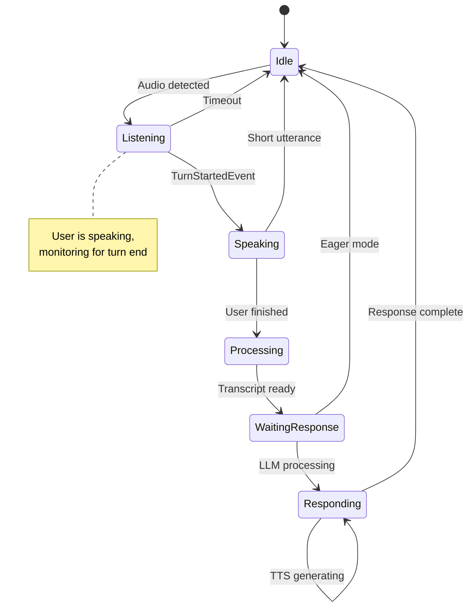
```mermaid
stateDiagram-v2
    [*] --> Idle
    
    Idle --> Listening: Audio detected
    Listening --> Speaking: TurnStartedEvent
    
    Speaking --> Processing: User finished
    Processing --> WaitingResponse: Transcript ready
    
    WaitingResponse --> Responding: LLM processing
    Responding --> Responding: TTS generating
    
    Responding --> Idle: Response complete
    WaitingResponse --> Idle: Eager mode
    
    Speaking --> Idle: Short utterance
    Listening --> Idle: Timeout
    
    note right of Listening
        User is speaking,
        monitoring for turn end
    end note
```

---

## Event Flow Diagrams

### Core Event Flow

```mermaid
flowchart TB
    subgraph EventTypes["Event Types"]
        AE[("Agent Events")]
        EE[("Edge Events")]
        LE[("LLM Events")]
        SE[("STT Events"))
        TE[("TTS Events"))
        TDE[("Turn Detection Events"))
    end
    
    subgraph AgentEvents["Agent Event Processing"]
        Sub[("Subscribe")]
        Emit[("Emit")]
        Handle[("Handle")]
    end
    
    AE --> Sub
    EE --> Sub
    LE --> Sub
    SE --> Sub
    TE --> Sub
    TDE --> Sub
    
    Sub --> Handle
    Handle --> Emit
    
    Emit --> EE
    Emit --> LE
    Emit --> SE
    Emit --> TE
```

### Event Subscriptions

```mermaid
flowchart LR
    subgraph Publishers
        Edge
        LLM
        STT
        TTS
        TurnDetector
    end
    
    subgraph EventManager["Event Manager"]
        EM
    end
    
    subgraph Subscribers["Agent Event Handlers"]
        OnAudio["on_audio_received"]
        OnTranscript["on_transcript"]
        OnTurn["on_turn_event"]
        OnLLMResponse["on_llm_response"]
        OnTTS["on_tts_audio"]
    end
    
    Edge --> EM: AudioReceivedEvent
    LLM --> EM: LLMResponseCompletedEvent
    STT --> EM: STTTranscriptEvent
    TTS --> EM: TTSAudioEvent
    TurnDetector --> EM: TurnEndedEvent
    
    EM --> OnAudio
    EM --> OnTranscript
    EM --> OnTurn
    EM --> OnLLMResponse
    EM --> OnTTS
```

---

## Plugin Architecture

### MCP Architecture

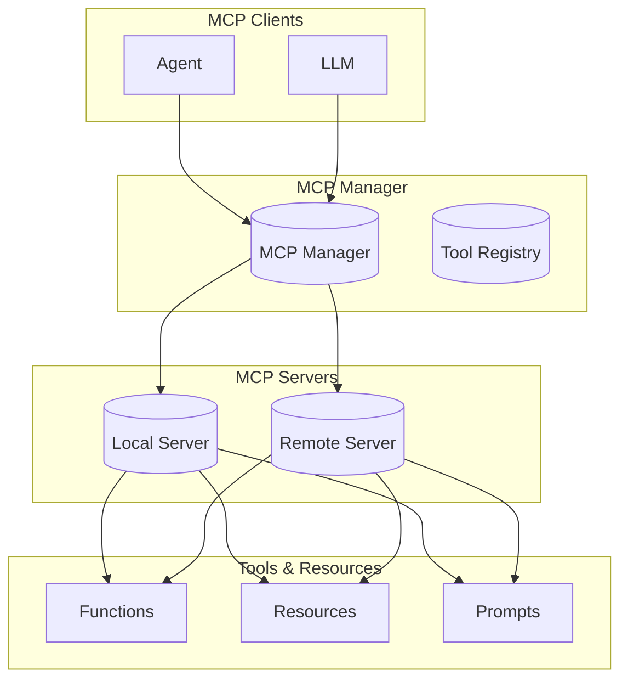
```mermaid
graph TD
    subgraph MCPClients["MCP Clients"]
        Agent["Agent"]
        LLM["LLM"]
    end
    
    subgraph MCPManager["MCP Manager"]
        Manager[("MCP Manager")]
        Registry[("Tool Registry")]
    end
    
    subgraph MCPServers["MCP Servers"]
        Local[("Local Server")]
        Remote[("Remote Server")]
    end
    
    subgraph Tools["Tools & Resources"]
        Functions["Functions"]
        Resources["Resources"]
        Prompts["Prompts"]
    end
    
    Agent --> Manager
    LLM --> Manager
    Manager --> Local
    Manager --> Remote
    
    Local --> Functions
    Local --> Resources
    Local --> Prompts
    
    Remote --> Functions
    Remote --> Resources
    Remote --> Prompts
```

### Plugin System

```mermaid
flowchart TB
    subgraph PluginInterface["Plugin Interface"]
        Base[("Plugin Base")]
    end
    
    subgraph LLMPlugins["LLM Plugins"]
        AnthropicPlugin
        OpenAIPlugin
        GeminiPlugin
        AWSPlugin
        HuggingFacePlugin
        OpenRouterPlugin
    end
    
    subgraph STTPlugins["STT Plugins"]
        DeepgramSTT
        FastWhisper
        FishSTT
        Wizper
    end
    
    subgraph TTSPlugins["TTS Plugins"]
        ElevenLabsTTS
        Cartesia
        AWSPolly
        Kokoro
        Inworld
    end
    
    subgraph ProcessorPlugins["Processor Plugins"]
        Ultralytics
        Roboflow
        Moondream
    end
    
    Base <|-- AnthropicPlugin
    Base <|-- OpenAIPlugin
    Base <|-- GeminiPlugin
    Base <|-- AWSPlugin
    Base <|-- HuggingFacePlugin
    Base <|-- OpenRouterPlugin
    
    Base <|-- DeepgramSTT
    Base <|-- FastWhisper
    Base <|-- FishSTT
    Base <|-- Wizper
    
    Base <|-- ElevenLabsTTS
    Base <|-- Cartesia
    Base <|-- AWSPolly
    Base <|-- Kokoro
    Base <|-- Inworld
    
    Base <|-- Ultralytics
    Base <|-- Roboflow
    Base <|-- Moondream
```

---

## Deployment Architecture

### HTTP Server Deployment

```mermaid
flowchart TB
    subgraph Client["Client"]
        WebApp["Web Application"]
        Mobile["Mobile App"]
        API["External API"]
    end
    
    subgraph LoadBalancer["Load Balancer"]
        LB[("nginx / Cloud LB")]
    end
    
    subgraph AgentServer["Agent Server"]
        Runner[("HTTP Runner")]
        Agent1["Agent Instance 1"]
        Agent2["Agent Instance 2"]
        AgentN["Agent Instance N"]
    end
    
    subgraph Infrastructure["Infrastructure"]
        Redis["Redis (Session Store)"]
        Stream[("Stream Edge")]
        ModelProviders[("Model Providers")]
    end
    
    WebApp --> LB
    Mobile --> LB
    API --> LB
    
    LB --> Runner
    
    Runner --> Agent1
    Runner --> Agent2
    Runner --> AgentN
    
    Agent1 --> Redis
    Agent2 --> Redis
    AgentN --> Redis
    
    Agent1 --> Stream
    Agent2 --> Stream
    AgentN --> Stream
    
    Stream --> ModelProviders
```

### Docker Deployment

```mermaid
flowchart LR
    subgraph Docker["Docker Container"]
        App["Vision Agents App"]
        Python["Python Runtime"]
        Models["Model Files"]
    end
    
    subgraph Host["Host System"]
        GPU["GPU (CUDA)"]
        CPU["CPU"]
        Memory["Memory"]
    end
    
    subgraph Network["Network"]
        Internet["Internet"]
    end
    
    Docker --> Host
    App --> Python
    Python --> GPU
    Python --> CPU
    Python --> Memory
    App --> Internet
```

---

## Session Management

### Session Registry Architecture

```mermaid
graph TD
    subgraph SessionRegistry["Session Registry"]
        Registry[("Session Registry")]
    end
    
    subgraph Stores["Storage Backends"]
        InMemory[("In-Memory Store")]
        RedisStore[("Redis Store")]
    end
    
    subgraph Session["Session Data"]
        SID[("Session ID")]
        CID[("Call ID")]
        AgentID[("Agent ID")]
        State[("Session State")]
        History[("Conversation History")]
    end
    
    Registry --> InMemory
    Registry --> RedisStore
    
    SID --> Registry
    CID --> Registry
    AgentID --> Registry
    State --> Registry
    History --> Registry
```

### Session Flow

```mermaid
sequenceDiagram
    participant Client
    participant Runner
    participant Agent
    participant SessionRegistry
    participant Edge
    participant Redis
    
    Client->>Runner: POST /agents/start
    Runner->>Runner: Create agent instance
    
    Runner->>Agent: Create Agent(config)
    Agent-->>Runner: Agent created
    
    Runner->>Agent: agent.join(call)
    Agent->>Edge: Join call
    
    Edge-->>Agent: Connection established
    Agent-->>Runner: Agent joined
    
    Runner->>SessionRegistry: register_session()
    SessionRegistry->>Redis: Store session data
    
    Note over Agent: Agent running
    
    Client->>Runner: GET /agents/{id}/status
    Runner->>SessionRegistry: get_session()
    SessionRegistry->>Redis: Retrieve session
    SessionRegistry-->>Runner: Session data
    Runner-->>Client: Status response
    
    Note over Agent: Call ended
    
    Agent->>Runner: Call ended event
    Runner->>SessionRegistry: unregister_session()
    SessionRegistry->>Redis: Delete session
    
    Runner->>Agent: close()
    Agent-->>Runner: Closed
```

---

## HTTP API Architecture

### API Endpoints

```mermaid
flowchart TB
    subgraph HTTPAPI["HTTP API"]
        subgraph Health["Health & Status"]
            Health[("GET /health")]
            Ready[("GET /ready")]
        end
        
        subgraph AgentEndpoints["Agent Endpoints"]
            CreateAgent[("POST /agents")]
            GetAgent[("GET /agents/{id}")]
            DeleteAgent[("DELETE /agents/{id}")]
            ListAgents[("GET /agents")]
        end
        
        subgraph CallEndpoints["Call Endpoints"]
            StartCall[("POST /calls/start")]
            EndCall[("POST /calls/{id}/end")]
            GetCall[("GET /calls/{id}")]
        end
        
        subgraph Metrics["Metrics"]
            GetMetrics[("GET /metrics")]
            GetAgentMetrics[("GET /agents/{id}/metrics")]
        end
        
        subgraph WebSocket["WebSocket"]
            WSEvents[("WS /events")]
        end
    end
    
    Health --> API["API Router"]
    Ready --> API
    CreateAgent --> API
    GetAgent --> API
    DeleteAgent --> API
    ListAgents --> API
    StartCall --> API
    EndCall --> API
    GetCall --> API
    GetMetrics --> API
    GetAgentMetrics --> API
    WSEvents --> API
```

### Request/Response Flow

```mermaid
sequenceDiagram
    participant Client
    participant API
    participant Runner
    participant Agent
    participant External
    
    Client->>API: HTTP Request
    API->>Runner: Route request
    
    alt Create Agent
        Runner->>Agent: Instantiate Agent
        Agent-->>Runner: Agent instance
        Runner->>External: Initialize services
    end
    
    alt Start Call
        Runner->>Agent: agent.join(call)
        Agent->>External: Connect to edge
        External-->>Agent: Connected
        Agent-->>Runner: Joined
    end
    
    Runner->>Runner: Execute business logic
    
    Runner-->>API: Response
    API-->>Client: HTTP Response
    
    Note over Client,External: Bidirectional events via WebSocket
```

---

## Additional Architecture Patterns

### Multi-Agent Communication

```mermaid
flowchart LR
    subgraph Agent1["Agent 1"]
        A1[("Agent Instance")]
    end
    
    subgraph Agent2["Agent 2"]
        A2[("Agent Instance")]
    end
    
    subgraph Shared["Shared Resources"]
        Edge[("Edge Transport")]
        Conv[("Conversation")]
        Store[("Session Store")]
    end
    
    A1 --> Edge
    A2 --> Edge
    Edge --> Conv
    Conv --> Store
```

### Event-Driven Processing

```mermaid
flowchart TB
    subgraph EventBus["Event Bus"]
        EB[("Event Manager")]
    end
    
    subgraph Producers["Producers"]
        P1[("Edge")]
        P2[("LLM")]
        P3[("STT")]
        P4[("TTS")]
    end
    
    subgraph Consumers["Consumers"]
        C1[("Agent Logic")]
        C2[("Metrics Collector")]
        C3[("Conversation Sync")]
        C4[("Custom Handlers")]
    end
    
    P1 --> EB
    P2 --> EB
    P3 --> EB
    P4 --> EB
    
    EB --> C1
    EB --> C2
    EB --> C3
    EB --> C4
```

---

## Summary

This architecture documentation covers:

1. **System Architecture** - High-level view of the Vision Agents framework
2. **Package Structure** - Directory organization of the codebase
3. **Component Diagram** - Core components and their relationships
4. **Class Diagrams** - Key classes including Agent, LLM, Processors
5. **Sequence Diagrams** - Important workflows:
   - Agent lifecycle
   - Audio processing pipeline
   - Video processing pipeline
   - Turn detection flow
   - MCP tool calling
6. **Data Flow Diagrams** - How data moves through the system
7. **State Diagrams** - Agent, connection, and turn detection states
8. **Event Flow** - How events propagate through the system
9. **Plugin Architecture** - MCP and plugin system design
10. **Deployment** - HTTP server and Docker deployment patterns
11. **Session Management** - Session registry and storage
12. **HTTP API** - API endpoints and request/response flow

For more details, see:
- [README.md](README.md) - Project overview
- [DEVELOPMENT.md](DEVELOPMENT.md) - Development guide
- [examples/](examples/) - Example applications
- [plugins/](plugins/) - Plugin implementations
